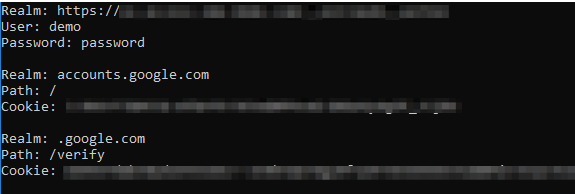

# ChromePasswords

Build in Visual Studio.

This is a cleaner refactor based on several publicly available examples of Chrome Password and Cookie extraction and decryption tools. It makes a temporary copy of the sqlite DB for Chrome, opens it, queries for passwords and cookies, decrypts the secrets, and then prints them to the console.

